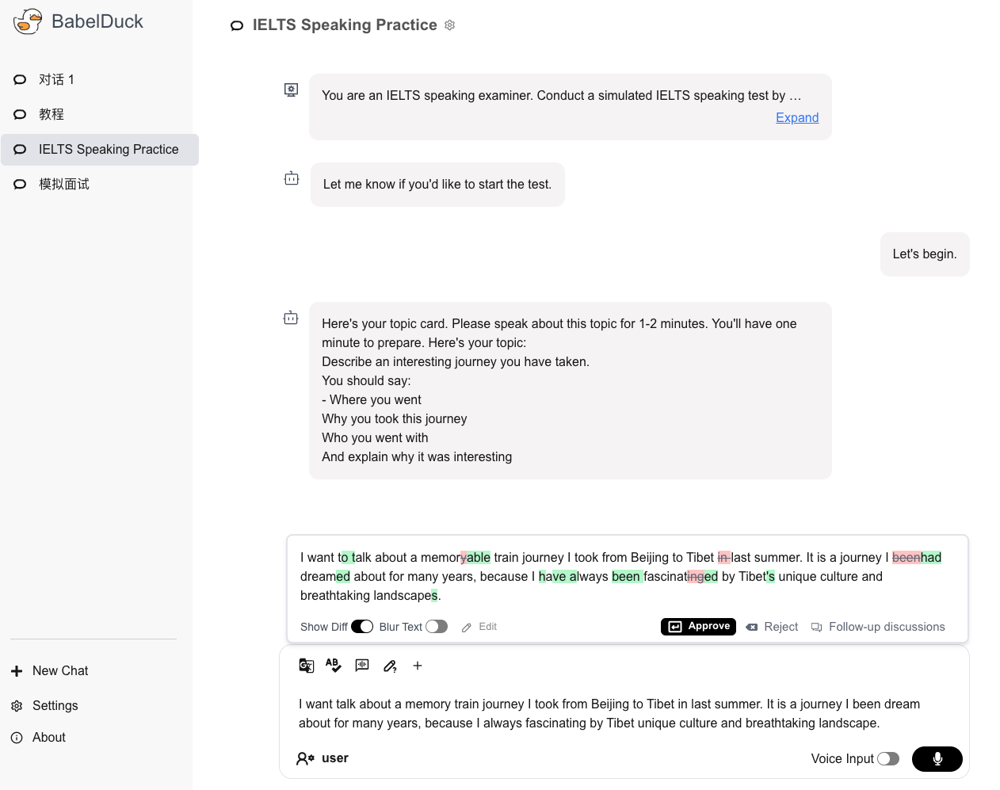

English | [简体中文](./README.md)

<h1 align="center">
  
  BabelDuck
</h1>

 

  <a href="https://duck.orenoid.com/">Website</a>

  
  

 

### 📖 Introduction

BabelDuck is a highly customizable AI conversation practice application designed for language learners of all levels, with a focus on being beginner-friendly and minimizing the barriers and cognitive load of oral expression practice.

### ✨ Key Features

- Supports common AI chat features including multiple conversation management, custom system prompts, and streaming responses
- Seek grammar, translation, or expression refinement suggestions from AI without interrupting the current conversation, with customizable quick commands
- When you have questions about AI suggestions, you can start a sub-conversation for further discussion and seamlessly return to the original conversation afterward
- Supports voice input and response
- Integrates multiple LLM AI services with seamless switching
- Data stored locally to ensure user data privacy and security
- Supports individual preference settings for different conversations
- Provides multilingual interface
- Built-in tutorials

### 🛠 Deployment

1. Install Docker
2. Clone the repository
3. Rename `.env.example` to `.env` and fill in the configurations
4. Run `docker run -d --name babel-duck --env-file .env -p 9000:9000 orenoid/babel-duck:latest`
5. Visit `http://localhost:9000` to see it in action

### 🎯 Roadmap

- [ ] Conversation templates
- [ ] Shadowing practice mode
- [ ] Voice playback
- [ ] Multimodal voice support
- [ ] More LLM/TTS/STT services integration
- [ ] Real-time voice mode
- [ ] More command types
- [ ] Plugin system
