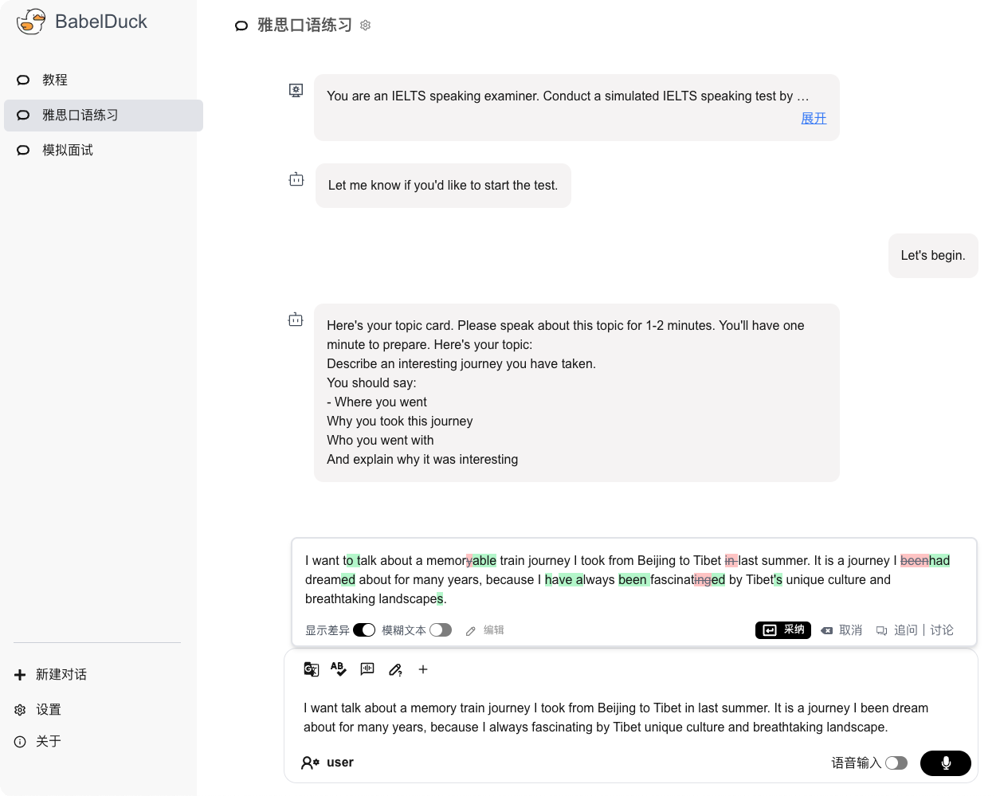

[English](./README-en.md) | 简体中文

<h1 align="center">
  
  BabelDuck
</h1>

<br/>

<p align="center">
  <a href="https://duck.orenoid.com/">Web 版</a>
</p>

<div align="center">
  <p align="center">  </p>
</div>

<br/>

### 📖 介绍

BabelDuck 是一个面向各水平层次语言学习者的高度可定制化 AI 口语对话练习应用，并对初学者更友好，旨在将口语表达练习的门槛与心智负担降至最低。

### ✨ 主要功能

- 支持多对话管理、自定义系统提示词、流式响应等常见 AI 对话功能
- 可在不影响当前对话的前提下，向 AI 寻求语法、翻译或表达润色等建议，并提供可定制化的快捷指令
- 在对 AI 提供的建议有疑问时，可开启子对话进一步讨论，讨论结束后可无缝返回原对话
- 支持语音输入与语音输出，集成了浏览器内置文本转语音 以及 Azure TTS
- 集成多种 LLM AI 服务，支持自定义第三方 API 服务，可无缝切换
- 数据存储于本地，确保用户数据隐私安全
- 支持针对不同对话进行单独的偏好设置
- 提供多语言界面
- 内置使用教程

### 🛠 部署

1. 安装 Docker
2. 克隆仓库到本地
```shell
git clone https://github.com/Orenoid/BabelDuck
```
3. 将 `.env.example` 文件重命名为 `.env`，并填入相关配置
4. 运行 Docker 容器
```shell
docker run -d --name babel-duck --env-file .env -p 9000:9000 orenoid/babel-duck:latest
```
5. 访问 `http://localhost:9000` 查看效果

### 🎯 未来规划

- [ ] 对话模板
- [ ] 复述练习模式
- [ ] 移动端适配
- [ ] 语音回放
- [ ] 支持多模态语音
- [ ] 接入更多 LLM/TTS/STT 服务
- [ ] 实时语音模式
- [ ] 更多指令类型
- [ ] 插件系统

### 📄 许可证
本项目采用 [LICENSE](https://github.com/Orenoid/BabelDuck/blob/main/LICENSE)，详情请参阅 LICENSE 文件。

### 💬 问题反馈

